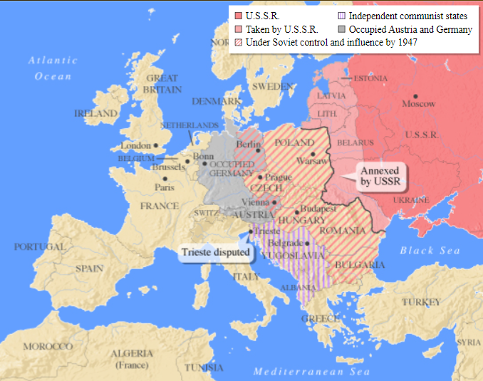
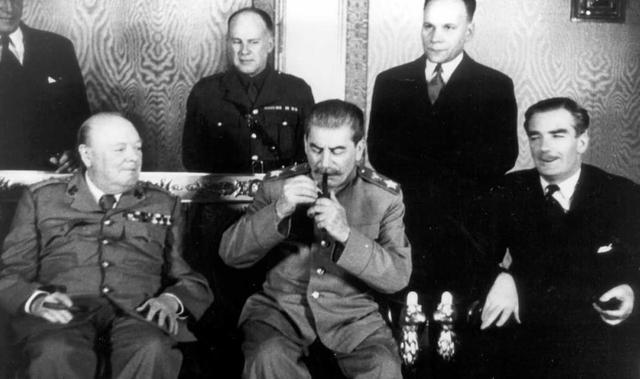

# 百分比协定

百分比协定是苏联领导人斯大林与英国领导人丘吉尔于1944年10月9日秘密签订的一项关于巴尔干半岛势力分割的条约。

## 背景

东线战场苏军进行战略反攻时，英美等西方国家开始发现随着苏军推进，整个东南欧开始并入社会主义阵营之中，而巴尔干半岛正是其中之一。

巴尔干半岛地处战略要地，一直是整块欧洲大陆的火药桶。巴尔干半岛地势多山，平原盆地支离破碎，导致该地区一直无法出现一个强大的民族来统一整个半岛（南斯拉夫的民族问题一直是这个国家的地雷）。更不幸的是，这块地区位于亚非欧三块大陆的交界处，历来都是兵家必争之地，同时也决定了这块半岛上同时容纳了斯拉夫人、匈牙利人、希腊人、土耳其人、塞尔维亚人、克罗地亚人等不同民族，东正教、伊斯兰教等不同宗教和文化在这里交融。这里民族矛盾、宗教矛盾、文化矛盾、地区发展矛盾并存，战火不断。

同时对于苏联来说，巴尔干半岛和附近的土耳其是控制整个里海的关键，如果控制了里海出海口，那么里海舰队就可以南下地中海，一路航行到苏伊士运河和直布罗陀海峡，整个地中海的资本主义国家的地中海舰队都无法阻挡这批红色海军的巨舰前行。对于英国来说，这样的场景简直就是灾难，因为一旦苏联想要进攻西欧，里海舰队甚至可以将苏军源源不断地送上整个西欧平原，然后里海舰队可以出直布罗陀海峡北上沿着伊比利亚半岛直上英吉利海峡（法国那边叫拉芒什海峡，叫法取决于你支持哪边）。英国在二战后期国力已经几乎耗尽，无力支撑皇家舰队再现日德兰海战那样的壮举。

因此，为了解决这一问题，1949年10月9日，丘吉尔与斯大林举行会谈。此时苏军已经控制了罗马尼亚和保加利亚，并推进至匈牙利和南斯拉夫境内，而南斯拉夫的铁托率领的南斯拉夫共产党武装也日益壮大，英国在巴尔干半岛可以仰仗的势力只有希腊和部分南斯拉夫地区。



## 谈判

1944年5月4日，丘吉尔在写给外交大臣艾登的一份备忘录中指出："我们两国之间存在着严重的问题……总的来说，如果我们的要抵抗共产主义在巴尔干的渗透和侵略，就必须在一切条件都允许的情况下，把问题直戳了当地提出来。"

在与南斯拉夫武装力量的谈判中，铁托拒绝了英国与南斯拉夫政府在未来共享权力的建议。丘吉尔决定亲自到莫斯科与社会主义阵营的老大哥斯大林谈判解决巴尔干问题。



=== "丘吉尔回忆录描述的过程"  
    1944年10月9日，丘吉尔开门见山地说：“*让我们来解决巴尔干地区的事情吧。*”

    丘吉尔知道苏联当时在巴尔干半岛的势力范围，一边说着他对未来苏英在巴尔干半岛的势力分划的建议，一边随手拿过一张纸在上面写下这些数字：

    

    ```yaml
    Romania 罗马尼亚 
                苏联90% 
                英国10%
    Greece 希腊 
                苏联90% # (1) 
                英国10% # (2)
    Yugoslava 南斯拉夫 
                苏联50% 
                英国50%（原文为50/50）
    Hungary 匈牙利 
                苏联50% 
                英国50%（原文为50/50）
    Bulgaria 保加利亚 
                苏联75% 
                英国25%
    ```

    1.  原文把“英国”划掉改成“苏联”
    2.  原文把“苏联”划掉改成“英国”

    令丘吉尔意外的是，斯大林接过纸条，拿起蓝色铅笔随手在上面打了一个勾，表示认可这项协定。过程如此顺利，以至于会后丘吉尔还心虚问道：“*我们如此地随便处置这项有关千百万人民命运的问题，是否显得玩世不恭了？要不我们把这张纸烧了吧？*”斯大林回应道：“*不，你留着它吧。*”

    整个会议是瞒着美国特使哈里曼进行的，虽然哈里曼预感到英苏会进行关于巴尔干半岛问题的谈判并尽力向罗斯福报告，但丘吉尔还是请斯大林对《百分比协定》保密：“*所谓的“百分比”也就是一种方式，它使我们能够具体地认知我们的亲密程度，为的是以后能够协调下一步的行动……（这些数字）如果落到全世界外交部和外交官的视野里，会显得多么粗鲁无礼，甚至是冷酷无情。*” 
=== "俄罗斯官方公开的访谈档案"
    下面是俄罗斯官方公开的访谈记录：

    1944年10月9日。22时。
    记录者：帕夫洛夫
    出席者：
    英方：艾登、克尔、比尔斯
    苏方：莫洛托夫、帕夫洛夫

    （这份记录开头是丘吉尔和斯大林商讨波兰问题的记录，略去，完整记录我放在这里。斜体是原记录带有的）
    *丘吉尔*称，他还有一些问题，这些问题涉及到迫于德国的压力而卷入战争，在战争中表现不好的那些附庸国。英国人对其中一些国家没有好感，而俄国人对另一些也是一样。如果斯大林同志同意，他建议由艾登和莫洛托夫去商讨这些问题。  
    *斯大林同志*表示同意。  
    *丘吉尔*说，英国人对其中的两个国家特别感兴趣。首先是希腊。他丘吉尔并不特别担心罗马尼亚。在很大程度上罗马尼亚是俄国人的事情，苏联政府所提出的对罗马尼亚的协定，已经被英国政府平静地承认，而且该协议表现出苏联政府的极大智慧。毋庸置疑，这项协议将会对世界和平起到促进作用。然而英国政府对希腊怀有极大的兴趣。英国政府希望在希腊问题上起到决定性的作用，正如苏联政府希望在罗马尼亚问题上一样。当然，无论是希腊问题还是罗马尼亚问题，英、苏双方都将保持密切接触。  
    *斯大林同志*回答，他明白，由于地中海的通道被德国人截断，英国蒙受到重大的损失。他斯大林同志明白，如果不能保证这条通道的安全，英国将受到巨大的损失。希腊是保证这条航道安全的一个重要据点。他斯大林同意英国拥有在希腊问题上的决定权。  
    *丘吉尔*回答，他准备了一份表格。他的想法都在这份表格中。或许最好用外交语言来描述，因为，美国人，包括总体在内，将会对于划分对欧洲的影响范围一事十分不快。  
    *斯大林同志*说，恰好他正想谈谈罗斯福。他收到罗斯福一封信，罗斯福在信中表示，希望哈里曼大使能够以观察员的身份出席丘吉尔
    *丘吉尔*说，他已经通知罗斯福说，他欢迎哈里曼加入与斯大林元帅的会谈。但是丘吉尔希望这不要影响他与斯大林之间以及莫洛托夫与艾登之间会谈所具有的秘密性质。

##  影响

会后丘吉尔感叹到真是“一份不严肃的文件”，但他决心实现这份不严肃的文件。

苏联如同协议要求那样，坐视英军在希腊境内的活动；而苏联在巴尔干半岛势如破竹的时候，英军也默契地没有北上。

很多后世历史研究者认为斯大林不重视希腊是有多方面原因：一是斯大林自认为苏联没有能力保持对希腊意大利等南欧国家的控制，二是斯大林本人对世界革命不感兴趣，三是斯大林对黑海出海口的控制争夺点落眼于土耳其上——一个与苏联相邻的邻国总比与一个南斯拉夫相邻的希腊好下手。