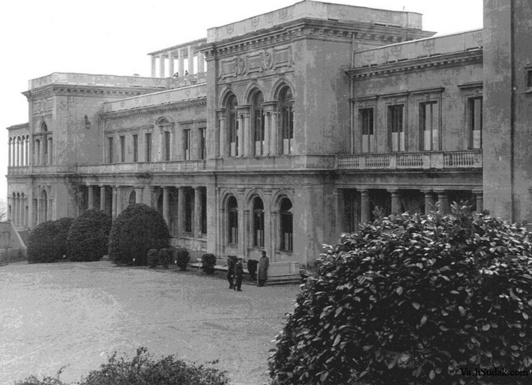
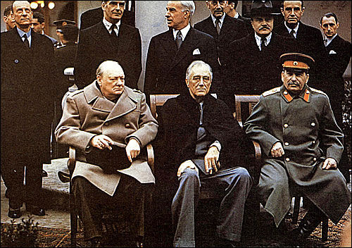

# 雅尔塔会议

>我的一边坐着巨大的俄国熊,另一边坐着巨大的北美野牛.中间坐着的是一头可怜的英国小毛驴。  
>——丘吉尔在雅尔塔会议后说道

1945年2月4日的克里米亚半岛上的雅尔塔宫，迎来了同盟国三位领导人——苏联的斯大林、英国的丘吉尔和美国的罗斯福，在接下来的7天之内，即到2月11日，这个行宫内达成的协定和条约决定了战后世界的一部分。在德黑兰、雅尔塔和波茨坦这三个地点上三巨头开了三次会议，会议上面达成的共识和后续一些条款，并称为雅尔塔体系，也就是现在我们国际社会所遵守的规则制度。

## 会议

此时，欧洲战场上德国法西斯败局已定。在不久前的1月25日，盟军结束了阿登反击战，德军最后的抵抗力量被消灭，苏联红军距离柏林只有60公里，柏林会战即将打响。但在亚洲和太平洋方面对日本法西斯的作战却不太令人满意。在武士道洗脑下的日本士兵使美军在太平洋战场上的推进中出现更多伤亡，让美国意识到登上日本本土可能更加困难。英美需要苏联对日作战。

同时盟军领导人们已经看到了整个反法西斯战场上法西斯败局已定。如何划分战后世界的势力范围就成为领导人们热议的论题。

雅尔塔会议就是在这样的背景下召开的。

### 德国问题

德国作为一战、二战的策源地之一，三巨头都看到了背后德国军国主义在作祟。如何处理战后的德国，并让它不再发动三战呢？

早在1943年11月28日-12月1日的伊朗德黑兰会议上，三巨头就已经讨论了战后处置德国的设想。罗斯福建议把德国分成五个部分（五等份的德国），其中基尔市、汉堡市和鲁尔区、萨尔区归联合国管辖；丘吉尔认为要彻底捣毁军国主义的策源地普鲁士，将南部各邦脱离德国，同奥地利和匈牙利成立一个“多瑙河联邦”。斯大林则提出苏联占领东普鲁士的柯尼斯堡以及周边地区，以及波兰一部分领土，作为对波兰补偿将德国部分领土划给波兰。斯大林是同意罗斯福的方案而反对丘吉尔的方案的，因为一个强大的“多瑙河联邦”不符合苏联的利益。

雅尔塔会议上就德国问题讨论了：

1. 战后如何处置德国
2. 对德国的占领和管制
3. 向德国索取战争赔偿

对于这些问题的讨论结果在雅尔塔会议公报上表述为：

1. **战后处置德国问题**  
   达成了原则上同意分割德国的协议，但没有提出具体的瓜分协议。在1944年9月11日，“欧洲咨询委员会”提出按照1937年12月31日德国边界，将德国划分为三个面积相同的占领区由美苏英占领，12月又决定从美国占领区分出一块区域给法国占领。  
   达成了“不永久占领德国，而是改造德国使其不再对世界和平造成威胁”的原则，并延续到对德改造上。  
   决定成立“盟国中央管制委员会”。  
2. **对德国占领和管制**  
   会议上决定对占领后的德国采取：
      - 解散德国全部武装力量，永久解散德国总参谋部。
      - 没收或销毁德国全部军事装备。
      - 公正迅速惩处一切战争罪犯。
      - 没收或管制德国全部用于军事生产的工业。
      - 废除纳粹党，废除纳粹法律、组织和机关。
      - 从德国的文化生活中消除纳粹主义和军国主义的影响。  
3. **向德国索取战争赔偿**  
   决定赔偿方式为索取实物赔偿，赔偿金额为200亿美元，其中50%归苏联战后建设之用。  
   决定设立赔偿委员会负责赔偿方面的问题。

### 东欧问题

苏联最为关系东欧问题。斯大林认为苏联的安全是用空间表达的。苏联需要东欧广阔的平原地带和尽可能西移的德国边界，为苏联获得一个缓冲地带，以防未来侵略会直捣苏联本土。

在1943年12月1日的德黑兰会议上，斯大林就明确指出：“*乌克兰人的土地必须归乌克兰，白俄罗斯人的土地必须归白俄罗斯，那就是说，在我们和波兰之间，苏联宪法规定的1939年的边界必须存在。苏联坚持有关这条边界线的规定，并认为这是正确的。*”在雅尔塔会议上就更显强硬：“*对于俄国人来说，波兰问题不仅是荣誉问题，而且是安全问题。在整个历史上，波兰一直是敌人入侵俄国的走廊，波兰是关系到俄国生死存亡之问题。*”

此时英美需要苏联承诺对德作战之后开启对日作战。因此在东欧，特别是波兰问题上，会议达成了有利于苏联的决定：

1. **波兰边境**
   决定采取“寇松线”作为波兰东部边界划分标准，不过因为波兰流亡政府的强烈意见，决定在北部、西部给波兰边境 5-8Km 外移的溢出（部分是1937年德国的领土，相当于波兰整体西移），不过最后西部边界具体划分留给未来讨论。苏联如愿以偿得到了西白俄罗斯和西乌克兰地区。
2. **黑海出海口问题**
   斯大林想要在雅尔塔会议上彻底解决黑海出海口问题，英美承诺会修改《蒙特勒海峡公约》，这个问题在[苏土黑海海峡危机](../cold_war_come/turkey.md)展开讨论
3. **南斯拉夫**
   建立一个由保皇党和共产党联合政府

### 远东问题

英美需要苏联开启对日作战，因此1945年2月11日签署的《雅尔塔协定》中答应苏联以下条件以换取苏联在结束对德作战三月内开启对日作战：

???+ tldr annotate "雅尔塔协定内容"
    苏美英三国关于日本的协定(雅尔塔协定)

    　　(1945年2月11日订于雅尔塔)

    　　 苏美英三大国领袖同意,在德国投降及欧洲战争结束后两个月或三个月内苏联将参加同盟国方面对日作战,其条件为:  
    　　1.外蒙古(蒙古人民共和国)的现状须予维持。  
    　　2.由日本1904年背信弃义进攻所破坏的俄国以前权益须予恢复,即:  
    　　(甲)库页岛南部及邻近一切岛屿须交还苏联;  
    　　(乙)大连商港须国际化,苏联在该港的优越权益须予保证,苏联之租用旅顺港为海军基地须予恢复;  
    　　(丙)对担任通往大连之出路的中东铁路和南满铁路应设立一苏中合办的公司以共同经营之 (1) ;经谅解,苏联的优越权益须予保证而中国须保持在满洲的全部主权。  
    　　3.千岛群岛须交予苏联。  
    　　经谅解,有关外蒙古及上述港口铁路的协定尚须征得蒋介石委员长的同意。根据斯大林大元帅的提议,美总统将采取步骤以取得该项同意。  
    　　三强领袖同意,苏联之此项要求须在击败日本后毫无问题地予以实现。  
    　　苏联本身表示准备和中国国民政府签订一项苏中友好同盟协定 (2) ,俾以其武力协助中国达成自日本枷锁下解放中国之目的。  

    　　斯大林
    　　罗斯福
    　  丘吉尔

1.  后来这两条铁路合并成为中长铁路（中国长春铁路）
2.  即1945年8月14日蒋介石政府和苏联签订的《中苏友好同盟条约》，1950年2月14日《中苏友好同盟互助条约》订立后，此约失效。

### 联合国问题

一战之后成立的国际联盟在调停阻止二战爆发上令人大失所望。三国决定取消成立一个新的国际联盟，即联合国。

为了换取苏联加入联合国的承诺，美国在东欧问题上迁就苏联的要求。这让为了维护英国在波兰影响的丘吉尔自嘲道：“*我的一边坐着巨大的俄国熊,另一边坐着巨大的北美野牛.中间坐着的是一头可怜的英国小毛驴。*”

这部分内容在[联合国成立]一节中详细描述。

## 扩展阅读

- [趣历史整理的雅尔塔会议专题](http://www.qulishi.com/huati/yaertahuiyi/)

**影视资料**

- [雅尔塔三巨头会面](https://www.bilibili.com/video/BV1BW411s7Xf)