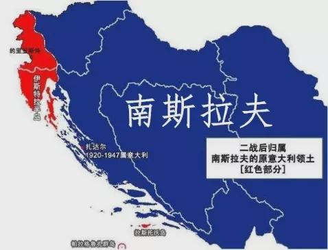

# 苏南交恶

1919年，南斯拉夫共产党成立。南斯拉夫共产党当时所要面对的南斯拉夫王国成立于1918年，这个王国地跨塞尔维亚、克罗地亚、斯洛文尼亚、黑山、波斯尼亚-黑塞哥维纳、马其顿、伏伊伏丁那和科索沃地区，是南斯拉夫地区历史上第一个独立国家。但这个国家经济上还是外国资本控制下的半殖民地国家。这方面的资料可以进一步参考国际共运史。

在1921年南共被宣布为非法政党，转入地下活动之后。南共开始分成左右两派并随后斗争剧烈，使得南共政治活动功能瘫痪，一度趋于分裂。1929年1月南斯拉夫国王亚历山大宣布实行君主独裁，南共发动武装起义准备夺权，但当时双方军事力量悬殊，是一次军事冒险行动。起义很快失败并导致党组织受到严重破坏，党的工作一度陷入停顿。1934年南共召开第四次全国代表大会，铁托当选为南共的中央委员会委员和政治局委员，南共开始重新活跃。

南共在反法西斯斗争中立下赫赫功劳。1941年4月6日，德国意大利联军不宣而战，入侵南斯拉夫，12天之后，也就是4月18日，南斯拉夫军队投降。4月15日铁托发表告人民书，宣布南斯拉夫共产党和工人阶级决心进行反侵略斗争直至最后胜利。两月后，南斯拉夫解放军游击队成立，铁托任总司令，在艰难的条件下展开长达4年的游击战，最后和苏联军队配合，于1945年5月15日解放了南斯拉夫全境，并于11月29日成立南斯拉夫联邦人民共和国。

>“兄弟的南斯拉夫各族人民和他们光荣的人民解放军反对德国侵略者的英勇斗争激起苏联各族人民的深切同情，成为激励欧洲一切被奴役人民的榜样。”  
>——斯大林于1944年3月7日

## 初生芥蒂

>“大地在颤抖,仿佛空气在燃烧,暴风雨要来了……”  
>——南斯拉夫电影《瓦尔特保卫萨拉热窝》

在二战之中，由于军事策略和政治考量不同，苏联和南斯拉夫开始积累矛盾。

苏联出于同盟国角度，在南斯拉夫问题上主张南共和南斯拉夫流亡政府合作，“*在南斯拉夫建立一个把希特勒和墨索里尼的所有敌人都包括在内的民族统一战线*”，但铁托坚决组建了一个纪律严明的无产者旅，这使得斯大林大为恼火，1942年3月5日特意让保加利亚共产党的季米特洛夫拍了一封电报给铁托：“*为什么你一定要搞个什么无产者旅？*”，但铁托不予理会。

南共在本地与德军展开艰苦的山地作战，但是苏联承诺许久的援助始终没来。铁托多次给苏联人发电报，要求支援药品、武器等，但都被苏联人拒绝了。最后铁托愤怒地发了电报称：“*如果你们不能支援我们，至少不要妨碍我们。*”

当时流亡伦敦的南斯拉夫政府指使留着南斯拉夫境内的将军米哈伊洛维奇成立切特尼克武装力量，明面上反抗轴心国，但私底下与德军勾结，一起进攻南斯拉夫人民解放军。南共屡次向共产国际报告他们的卖国行径和冒充军功来向同盟国索求武器支援的行为，但共产国际以维持与英美的同盟关系为考量，决定不公开反对南斯拉夫流亡政府，但也不承认米哈伊洛维奇是南斯拉夫抵抗运动唯一领袖。1942年底，设立在苏联境内的“自由南斯拉夫”电台公开了切特尼克的卖国行径，结果引来流亡政府向苏联的抗议，共产国际再次警告南共要服从大局。

1942年秋，南共觉得成立临时政府的条件成熟，于11月26日召开人民解放军反法西斯第一次会议。铁托在12日电告莫斯科这一信息，但莫斯科很快回答：“*在现阶段，你们不要提出废除君主政体的问题。不要提出建立共和国的口号。你们所理解的南斯拉夫政体问题，将在粉碎德意联盟之后和国家从占领者手中获得解放之后再予解决。*”

但随着人民解放军力量不断壮大，南共还是在1943年11月29日于亚伊策宣布成立人民委员会，并宣告自己是南斯拉夫的合法政府。当时同盟国三巨头正在德黑兰召开德黑兰会议，消息传到德黑兰时候，斯大林大为震惊，认为南共是“*在苏联和德黑兰决议的背后捅了一刀*”。英美也感到吃惊，但考虑到铁托率领的南斯拉夫人民解放军在战后将会在南斯拉夫境内占据优势，深信南共这一举动是得到苏联默许的，而且英美当时正在筹备诺曼底登陆，同时英美还不愿在主要胜利前与苏联撕破脸，于是承认了铁托新政府，也不反对铁托所作的包括反对国王回国的决定。苏联在得知英美态度之后，也于两周之后发表声明肯定了南共。但三巨头还是只承认流亡政府是**唯一合法**政府。

## 委屈的南共

>南斯拉夫是个小国，唯有得到苏联的支持才能生存，解放南斯拉夫的不是别人，是我们俄罗斯人，我们有资格叫你们做我们认为你们该做的事。  
>——1947年驻南斯拉夫某苏联教官

战后的领土问题和经济建设上，苏联和南斯拉夫双方也有不小的冲突，双方的矛盾也越来越深。

### 南意领土争端

的里雅斯特位于亚得里亚海北部南斯拉夫与意大利的交界处，是多瑙河地区通向亚得里亚海的一个重要通道。历史上南斯拉夫和意大利对于这个地区的所属权争执不休。

1945年2月27日，丘吉尔写信给杜鲁门：“*在我看来，占用的里雅斯特似乎是很重要的……最重要的是，我们要在铁托的游击队占领该地区以前到达那里，占有它就可以在法律上构成有力的根据。*”英美一方面希望占领这块战略要地，另一方面也担心如果南斯拉夫得到这块区域可能会有利于苏联。

1945年5月，英美军队准备占领这块地区时候发现南斯拉夫早已占领了这块地区。英美立即要求南斯拉夫撤出该区域，同时联系苏联希望南斯拉夫让出这块地方。

出于与盟友合作的考量，苏联虽然认为南斯拉夫驻扎那里合情合理，但还是在1945年7月的美苏英法四国外长会谈上擅自接受法国的建议：的里雅斯特分成英美占领区和南斯拉夫占领区两地区，这个决定并未和南共商量，甚至在**前一天晚上**南外长卡德尔和苏外长莫洛托夫交谈时候，也没有透露。铁托为此很不愉快，因为这是事关南斯拉夫主权和独立的问题。

### 苏南经济冲突

在经济建设上，苏联出于自身利益考虑，处处要求南斯拉夫的经济建设要服从苏联自身的经济建设，换句话说，苏联希望南斯拉夫成为自身的经济卫星国。

苏联和南斯拉夫合资成立的两个国营公司，分别主管空运和水运两个运输交通方面。在南斯拉夫经营期间，苏联控制这两个公司，不顾南斯拉夫经济建设需要，私自调价。

这些事件都显示了苏联的大国主义对社会主义兄弟国家的粗暴干涉。

## 啊，别了朋友

战后南斯拉夫在外交上开始表现出独立性，在一些事务上在没有通知斯大林的情况下便做了决定，这让苏联大为光火。

南斯拉夫主动拒绝了西方的马歇尔计划，并与苏外长莫洛托夫商讨制定经济援助计划来反制。苏联对南斯拉夫这种*主动帮大哥着想的精神*十分欣慰，把共产党情报局中心放在南斯拉夫首都贝尔格莱德，并设立无线电中心。但南斯拉夫拒绝西方计划是出于自身制度要求和对独立的渴望，苏联此时的战略却是抚平战后创伤、尽可能避免与西方冲突，这就决定苏联可能会随时牺牲兄弟国家的利益来换取自己发展的时间，这种外交思路在二战前就已经初现端倪。

### 南保合并事件

早在19世纪，就有人提出要将巴尔干半岛的斯拉夫人联合起来以组成一个统一的国家，因为他们有共同的文化基础。二战期间，铁托和季米特洛夫便开始讨论南斯拉夫和保加利亚合并成一个联邦的问题，当时苏联是赞成这种合并的，但随后不久为了苏联在巴尔干半岛的控制，斯大林很快就反悔了。

两国领导人对成立这个巴尔干半岛联邦很满意，宣称一个统一的国家就要出现在巴尔干半岛上，铁托甚至还额外邀请了阿尔巴尼亚一起加入这个联邦。当然南斯拉夫和保加利亚对于合并方式仍然不确定。得知南斯拉夫和保加利亚私底下决定合并的事宜，斯大林叫铁托与季米特洛夫前往莫斯科，对他们大发雷霆一通，合并便也不了了之。

### 进军阿尔巴尼亚

希腊内战开打之后，为了援助希腊共产党，南斯拉夫准备派遣一些军队进驻与希腊接壤的阿尔巴尼亚。斯大林知晓之后，担心社会主义阵营援助不在雅尔塔体系内的希腊会引起西方的敌意和不满，立刻要求南斯拉夫停止行动。

三番五次被干涉国家事务，而且一副大家长做派，南斯拉夫最后于1948年与苏联分道扬镳。

!!! tldr annotate ""  
    1.**在物质生产领域建立联合劳动基层组织、劳动组织和联合劳动复合组织，由劳动者选举工人委员会进行管理。**它被认为有利于直接生产者与生产资料的直接结合。保证劳动者获得对生产资料的管理权以及除了整个社会需要而提出的资金之外的企业收入的分配权。它可以使劳动者真正成为自己劳动成果和条件的主人，杜绝私有垄断和国家垄断。也就是：  
        1) *工厂和企业由直接生产者自行管理。*   
        2) *新经济制度应当建立在客观经济规律的基础之上，应当尽可能避免采用行政命令方式遏制这些规律。*  
        3) *社会对客观经济规律的控制应当坚决地在最广泛的范围内进行，在社会计划基本比例（社会计划确保社会生产不致于出现资本主义的无政府状态，同时又为国家的经济的发展指明了总的方向）的范围内，要最大限度地发挥直接生产者的主动性。*  
        4) *社会真正占有劳动和对剩余劳动实现社会主义的管理*  
    2.**在社会事业部门建立自治利益共同体和其他自治组织以及社会政治共同体等自治形式，在其中建立代表会议，对教育、科学、文化、保健等部门向经济部门提供劳务问题进行协商，作出决定。**   
    3.**在区、自治省和共和国以及联邦，建立代表团制议会，作为劳动人民的直接政权。劳动者和其他公民用直接的无记名役票方式从基层组织中选出一定数量的代表组成代表团，从代表团成员中选派代表参加区、自治省、共和国和联邦议会。代表团可以选派对所讨论的问题最熟悉的代表出席议会会议。**它被认为是以比较民主的形式吸收最广大群众参加社会政治生活，如决定社会政策，罢免、选举干部，解决与社会主义自治、社会发展有关的各方面的问题，从而进一步发展社会主义新型民主，防止出现干部的独断专行。

这个是南斯拉夫与苏联分道扬镳之后，于1950年开始实行的工人自治社会主义制度，可以看出南斯拉夫做出的与苏联模式不同的改变。

## 扩展阅读

[南斯拉夫的地缘政治分析](https://zhuanlan.zhihu.com/p/25621808)