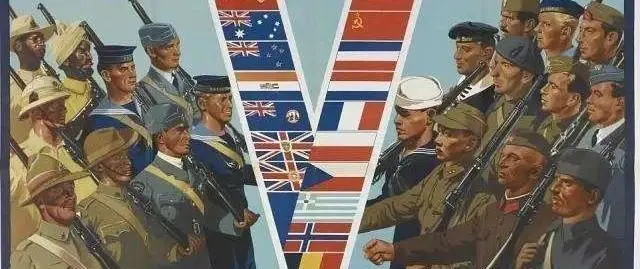

# 对立的阵营

> 苏联是一个对西方世界构成严重威胁的国家。我讲的不是军事威胁。从本质上讲，军事上的威胁并不存在。我们这些国家装备精良，包括核武器。我指的是经济上的威胁。借助计划政策，加上独特的精神上和物质上的刺激手段，苏联的经济发展指标很高。其国民生产总值增长率过去比我们高出一倍。如果再考虑到苏联丰厚的自然资源，如果加上合理地运营，那么苏联完全有可能将我们挤出世界市场。因此，我们一直采取行动，旨在削弱苏联经济，制造其内部问题。  
> ——玛格丽特·撒切尔，1991年11月于休斯顿演讲时

意识形态斗争自从苏俄1921年成立以来，就一直是作为布尔什维克们不可避免的任务。西方世界从苏俄成立到苏联解体之后，甚至到今天的俄罗斯，一直呈现着全面绞杀的姿态，其原因可以从撒切尔夫人的这篇演讲中探出冰山一角。

