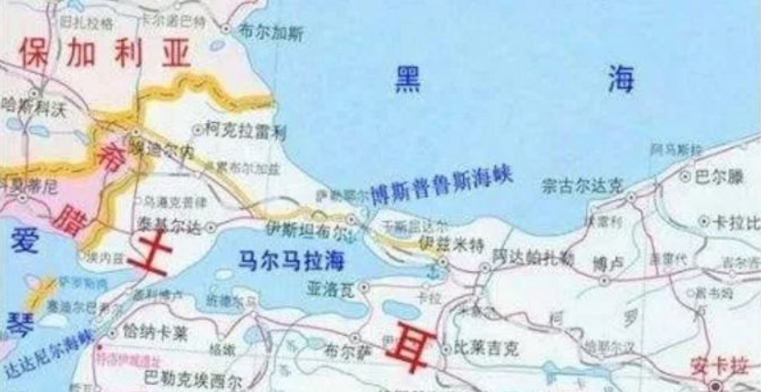

# 苏土黑海海峡危机

沙皇彼得大帝在遗嘱中，为他的俄罗斯人民规划了三条俄罗斯扩张路线。第一条是从黑海土耳其博斯普鲁斯海峡到地中海，再经苏伊士运河进入红海；第二条是从南高加索地区经[伊朗]()地区到达波斯湾；第三条是从中亚地区南下，经[阿富汗]()、北印度，进入印度洋和阿拉伯海。土耳其、伊朗、阿富汗，对于冷战史有些了解的读者都知道了这三个国家与苏联的故事，下面就是土耳其和苏联在黑海上的故事。

## 背景

一战后土耳其面临主权危机，巴黎和会上面签订的《色佛尔条约》严重损害了土耳其的主权，希腊军队占领了土耳其的伊兹密尔港(Izmir)。为此凯末尔(Mustafa Kemal Atatürk,1881-1938)发动革命，成立土耳其军民大会(Grand National Assembly of Turkey)，赶跑了侵略者并成立了土耳其共和国。

1921年，苏联承认土耳其共和国，并与其签订了《苏土友好条约》（全称《俄罗斯苏维埃联邦社会主义共和国土耳其友好条约》）。在土耳其海峡问题上，条约规定“*为了保证海峡开放和各国自由通过海峡来进行商业联系，缔约国双方同意由沿岸各国代表组成的特别会议来最后拟订黑海和海峡的国际条例，条件是，会议所通过的决议不能损害土耳其的完整的主权和土耳其及其首都君士坦丁堡的安全。*”

关于土耳其海峡的管理权一直是近代欧洲和俄罗斯的一个冲突点。俄罗斯地跨欧亚，但却没有理想的出海门户。太平洋方向只有海参葳有8个月的解冻期，离内地又太远；北冰洋方向只有一两个不冻港；波罗的海方向海况复杂，而且还得穿过英吉利海峡或绕过英伦三岛才能出海；唯一理想的是周边国家甚多，交易频繁，黄金水道众多的黑海，俄罗斯一直心心念念想要控制黑海出海口。

一战结束后黑海周边国家签订了《蒙特勒海峡公约》，明确规定：*在任何情况下，军舰通过海峡时不得使用舰载飞机；战时，如土耳其中立，禁止任何交战国军舰通过海峡，如土耳其参战，由其决定是否允许军舰通过。*

## 开始

二战中，土耳其虽然靠着《苏土友好条约》，没有让德国借道土耳其进攻苏联，但土耳其与德国眉来眼去，又没有及时加入同盟国。二战结束后，苏联以此为由，1945年3月19日，照会土耳其单方面宣布废除《苏土友好条约》。

土耳其议会一片惊慌，4月4日提出重新缔约要求。6月7日苏联外长莫洛托夫召见土耳其大使时提出四项修约要求：

1. 土耳其东部的卡尔斯、阿尔达罕地区交还苏联
2. 允许苏联接管黑海海峡，苏联拥有在海峡修建海军基地的权力
3. 修改《蒙特勒海峡条约》
4. 土耳其调整与保加利亚的边界

1918年苏俄为了退出一战，与德奥联盟签订了《布列斯特合约》，其中奥斯曼帝国兼并了阿尔达罕-卡尔斯-巴统地区。1921年的苏俄与凯末尔土耳其签订《苏土友好条约》后，土耳其归还了巴统和纳希切万地区。

这些要求对于土耳其过于苛刻，土耳其拒绝了苏联。

苏联陈兵苏土边境，对土耳其施加强大的军事压力。土耳其不得不向西方求助。

美国并不愿意苏联控制黑海海峡，派遣第六舰队进入地中海与苏联对峙。

1945年雅尔塔会议上，斯大林打算解决黑海海峡问题，他在会议上说：“*土耳其可以任意封锁海峡，一个小国可以随意卡住一个大国的咽喉。假如一个类似的政权存在于直布罗陀，将会在英国引起何等震动，或者这样一个政权存在于巴拿马运河，美国又将引起何等震动。*”

英美当时为了让苏联尽快开始对日作战，提出修改《蒙特勒海峡公约》的建议。战后苏联继续谈判，结果只得到一个“原公约继续有效”的结果。

战后苏联想要继续尝试控制土耳其。美国总统杜鲁门发表对希腊-土耳其援助的演讲，提出了杜鲁门主义。随后向土耳其提供3亿美元援助。西方也发现了土耳其与苏联接壤的事实，决心把土耳其变成对抗苏联的前沿阵地。冷战中，土耳其接受了马歇尔计划并成为了北约中的一员。

## 扩展阅读：

**关于黑海海峡的历史**

- [澎湃对土耳其海峡问题的报道](https://www.thepaper.cn/newsDetail_forward_17057251)
- [俄土关系的评析](https://zhuanlan.zhihu.com/p/39303141)