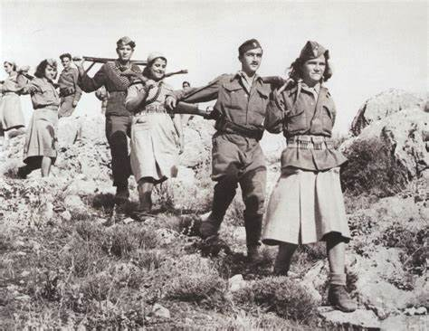
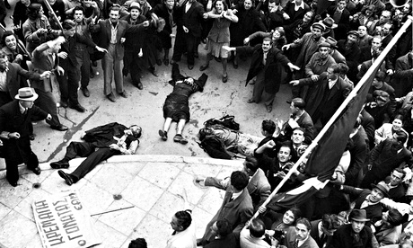

# 希腊内战

希腊内战是一场比较典型的冷战早期影响下的局部战争，本文内容需要结合战后局势划分和杜鲁门主义出现来阅读，读者可在阅读后参考这两方面的资料。

希腊共产党(Κομμουνιστικό Κόμμα Ελλάδας,KKE)成立于1918年，是和十月革命差不多年轻的一个政党。

## 希腊局势

希腊位于巴尔干半岛最南部，位于整个欧洲的火药桶边缘上，这也就预示了希腊这个民族多灾多难的命运。

1941年，墨索里尼发动意希战争，希腊人民通过顽强抵抗，击退了意大利军队的进攻。为了拯救盟友墨索里尼，同时也是为了彻底拿下整个巴尔干半岛作为巴巴罗萨行动进攻苏联的跳板，希特勒出兵希腊。纳粹德军很快占领了希腊全境，国王乔治二世和希腊政府流亡到埃及开罗成立流亡政府。

这个流亡政府的前身是1929年大萧条时期军队推翻希腊第二共和国建立的，因此它的存在自始至终在希腊国内都充满了争议。

希腊政府流亡在外，希共和一些左翼党派在1941年9月和12月先后建立“希腊民族解放阵线”(Εθνικό Απελευθερωτικό Μέτωπο,EAM)和归属解放阵线领导的“希腊民族人民解放军”(Ελληνικός Λαϊκός Απελευθερωτικός Στρατός,ELAS)，作为对法西斯侵略者的抵抗力量。

民族人民解放军从农村起兵，和法西斯侵略者顽强作战。在1944年，160多万人的解放阵线和7万多人的民族人民解放军业已解放大部分国土，建立了临时民主政权，和开罗流亡政府以及雅典傀儡政府成三足鼎立之势。同时与法西斯侵略者作战的还有由共和主义者与民主主义者成立的“全国

随着苏联在东线战场上的多次进攻，时日不多的纳粹德国不得不于1944年10月撤出希腊。当德军撤出希腊那一天，无数希腊人民走向街头，高呼“我们自由了！”1944年10月12日，德军撤出雅典，左翼武装进驻雅典，在郊外驻扎下5万人的民族人民解放军成员。

1944年意大利解放时候，开罗流亡政府就转移到意大利半岛，准备接手希腊政权。根据盟军事先的协议，希腊会举行全民公投决定是否保留君主制，实行民主选举来选出政府领导者。对于此时已经控制了希腊大部分领土的希共来说，赢得选举是轻而易举的事情，但是意想不到的事情发生了。

希腊的地理位置决定了这块地盘如果被社会主义阵营控制，那么苏联的黑海舰队就得以南下到地中海，届时整个地中海沿岸的西方国家（也是资本主义的腹地）就会处在苏联无时无刻的威胁之中。1944年8月17日，英国首相丘吉尔就在一封秘密备忘录中提到，“*战时内阁格外关注德军离开后，新政府组建前，这段时间内雅典发生的事情。共产主义激进分子和人民解放阵线很可能趁机夺取城市的控制权。*”

丘吉尔对苏军在东线战场的推进速度感到忧心忡忡。他于1944年10月9日就乘飞机飞往莫斯科，与斯大林签署了《百分比协定》，划定英国和苏联在巴尔干半岛的势力范围。协议中斯大林承诺不会干涉英军在希腊的行动。斯大林还特地联系希共，要求他们不要轻举妄动。

1944年10月，英国首批伞降部队进入希腊，协助民族人民解放军解放希腊全境。然后希腊流亡政府和国王回到雅典。在雅典郊外仍然驻扎着5万人的民族解放阵线成员的情况下，要求民族人民解放军放下武器原地解散。

这种行为摆明了是要强行摘希共反法西斯斗争的果实。

## 第一次武装冲突

1944年12月3日，民族解放阵线组织雅典数十万人游行示威和罢工。此时他们还对前来的盟军们表示热烈欢迎，游行队伍有人还举着英美苏的国旗，高呼“丘吉尔万岁！罗斯福万岁！斯大林万岁！”当游行队伍行进到宪法广场上时，国会大楼的警察突然开枪，随后枪林弹雨射向毫无防备的游行群众。这次事件造成了30人死亡，148人受伤。

流亡政府蓄意挑起内战。随后英军和政府军开始进攻民族人民解放军。英国的轰炸机战斗机扫过民族人民解放军的阵地，英军的大炮向阵地轰鸣。希腊人民惊呆了，在他们眼里，这一切太熟悉了，当年纳粹德军与他们作战时候，也是这副模样。1945年1月5日，民族人民解放军被迫撤离雅典，此时民族人民解放军仍控制大部分领土。

民族人民解放军在希腊解放期间，扩大化了清理“卖国贼”的行动，总共处决了8000余人，导致希共四处树敌。在撤离雅典时候，民族人民解放军又带走2万余人作人质。这些举动都损害了希共在人民心中的支持度，为日后的失败埋下伏笔。

欧洲战场仍未胜利，盟友自己就内讧的闹剧震惊了同盟国内部。丘吉尔的联合政府遭受严重的政治危机，来自美国和英国民间的质问淹没了英国政府，丘吉尔不得不亲自前往希腊斡旋。双方于2月12日签订了《瓦尔基扎协定》，民族人民解放军交出武器宣布解散。

## 第二次武装冲突

虽然民族人民解放军名义上解散了，但部分成员改组成为希腊民主军(Δημοκρατικός Στρατός Ελλάδας,DSE)秘密活动。南斯拉夫成立后，向希共提供支援，希共决定重启武装斗争。

1946年3月希腊选举，希共抵制选举，保皇派的希腊人民党因此获胜。9月1日举行公投，69%赞成国王回国，希腊原国王乔治二世再次复位。9月28日乔治二世返回雅典，君主制复辟。随后希腊掀起一场反共运动，大量希共党员和左翼分子遭受舆论打压。希共和民主军不得不进入山区开展游击战，希腊内战全面爆发。

在战争初期，希共和民主军粉碎了敌人多次围攻，扩大了控制范围。1947年12月，民主军在北部山区建立了临时民主政府，民主军总司令、希共总书记马科斯·瓦菲阿迪斯(Markos Vafeiadis,1906-1992)任总理。

希腊民主军的强大攻势下，政府军节节败退,不得不向英国政府求援。英国此时战后经济崩溃，无力援助希腊雅典政府。眼看着希腊即将落入希共手中，美国决定插手其中。

1947年3月12日，美国总统杜鲁门在国会的关于援助希腊与土耳其咨文中，发表了著名的“遏制共产主义”演说，**杜鲁门主义正式形成，标志着冷战正式形成**，关于这方面的详细内容我们会在【杜鲁门主义】一节展开讨论。随后杜鲁门的美国政府制定了希腊-土耳其援助计划，插手希腊内政，提供3亿美元援助和7.4万吨军事装备。

>这里将谈到我国的外交政策和国家安全的问题。  
>我这想请你们考虑和决定现今情势中的一个局面，它是跟土耳其和希腊有关的。  
>美国也已接到希腊政府有关财政和经济援助的紧急要求……  
>希腊的生存，受到共产党领导的数千武装人员恐怖活动的威胁，他们在很多地点，特别是沿着希腊北部边境，对抗政府的管辖……  
>希腊如果要成为一个自立自尊的民主国家，必须要有援助。而美国必须给予这种援助。我们已经给予希腊某种救济和经援，可是还不够。民主希腊没有别的国家可以求助了。也没有别的国家愿意并能够为民主希腊政府提供所需要的支持……  
>……  
>……如果希腊陷于掌握武装的少数人控制下，对它的邻国土耳其，就会有直接和严重的影响。混乱和骚动就可能遍布整个中东。况且，欧洲有些国家的人民，一方面在治疗战时的疮痍，一方面排除万难，努力奋斗，维护他们的自由和独立，如果独立的希腊一旦消灭，对这些国家也会有严重的影响。  
>……  
>如果我们在这个关系重大的时期不去帮助希腊和土耳其，其影响不仅殃及西方，而且远及东方。我们必须采取立即的和果断的行动……  
>——*杜鲁门1947年9月12日在国会演说的节选*

1947年11月，美希联合总参谋部成立，以詹姆斯·奥尔沃德·范佛里特(James Alward Van Fleet,1892-1992)为首的美国军事代表团控制希腊政府军的指挥权。范佛里特借此机会，将英械的希腊政府军更换上了美械，并高强度训练他们，并开始积累镇压游击活动的经验。希腊内战成就了范佛里特“山地战专家”的名号，后来的朝鲜战场上的上甘岭战役，他被委于重任，结果他创造了“范佛里特弹药量”，这是后话。

此时如果希共选择进入山区开展游击作战，那么还有可能与政府军周旋，但在这生死攸关的时刻，希共犯下了两个致命的错误。

第一个是政治上的。1949年，苏南交恶，站队问题就成为希共的重大问题。是忠于世界社会主义阵营领袖斯大林，还是维系长期支持他们作战的南斯拉夫的铁托？大部分希共领导人选择支持斯大林，而瓦菲阿迪斯选择支持铁托，后者于1949年1月因为“铁托主义”被撤销政治和军事的一切职务。作为回应，南斯拉夫于1949年7月关闭对希腊民主军全面开放的边界并驱逐了南斯拉夫境内的全部民主军官兵。

留给希腊民主军活动的邻国只剩下了阿尔巴尼亚，与南斯拉夫的决裂迫使希共和希腊民主军不得不“肃清铁托分子”，造成内部士气和军纪涣散，也使得希共失去很多城市居民的支持。

第二个是军事上策略错误。希共没有选择在山区开展游击战，而是将民主军主力与政府军展开阵地战。本来人数就不多的民主军是无法与得到西方支援的政府军持续作战的，因此在民主军强攻几处大城市失败后，希腊内战胜利的天平开始向政府军倾斜。

1949年8月，在美国支持下的希腊政府军在亚历山大·帕帕戈斯将军(Alexander Papagos,1883-1955)计划下，发起“火炬行动”。民主军已经无力应对这场阵地战，随后大部分民主军被迫撤往阿尔巴尼亚，但在苏联影响下，9月阿尔巴尼亚政府告诉希共，他们不能在阿尔巴尼亚领土上展开军事行动。10月16日，希共宣布“临时停火以保全整个希腊不被彻底毁灭”，标志着希腊内战实际上的结束。

## 后果

希腊内战造成了750多万人口的希腊中有15.8万人伤亡，80万人流亡海外。本就饱受战火摧残的希腊经济再受重创，1949年的经济状况甚至比不上1945年二战胜利后。

内战给希腊左翼右翼造成了不可弥补的裂痕。在左翼看来，同样是辛辛苦苦与纳粹抗争多年，为什么意大利共产党等他国左翼就能得到尊重，而希腊左翼却饱受打压。对于右翼，对左翼的严重不信任造成了1967年军队右翼分子发动政变，推翻民主政权成立军政府。直到1974年军政府垮台希腊公投成立民主制才有所缓和。时至今日，希腊政坛上，左翼和右翼的斗争比其他西欧国家还要激烈（参考希腊共产党在今天的嘴炮强度就知道了）。

对于美国和西方国家来说，他们这次介入希腊内战和干涉土耳其算是成功控制了黑海出海口这个战略要道。西方得到一个在巴尔干半岛的桥头堡，也保住了地中海不会成为黑海舰队的天下。

对于苏联和社会主义阵营，这次不干涉的态度为日后苏联腹地受到威胁埋下伏笔。当黑海舰队只能在黑海上打转，土耳其的中程导弹基地建立时候，苏联终于尝到此次不干涉的苦果。

很多后世历史研究者认为斯大林不重视希腊是有多方面原因：一是斯大林自认为苏联没有能力保持对希腊意大利等南欧国家的控制，二是斯大林本人对世界革命不感兴趣，三是斯大林对黑海出海口的控制争夺点落眼于土耳其上——一个与苏联相邻的邻国总比与一个南斯拉夫相邻的希腊好下手。

扩展阅读：

**关于希腊内战的详细过程可以参考**
- 《希腊内战：一场国际内战》， (加)安德烈·耶罗利玛托斯著，贺俊逸编，阙建容译，格致出版社，2021年3月版
- [Military  Wiki的希腊内战词条](https://military-history.fandom.com/wiki/Greek_Civil_War)
- [万维百科（国内审核过的维基百科）的希腊内战词条](https://www.wanweibaike.net/wiki-%E5%B8%8C%E8%85%8A%E5%86%85%E6%88%98)
- [中青报关于宪法广场事件的采访](http://qnck.cyol.com/html/2014-12/17/nw.D110000qnck_20141217_1-13.htm)
- [趣历史整理的希腊内战专题](http://www.qulishi.com/huati/xlnz/)

**对希共斗争失败原因的反思**
- 有很多资料都认为苏联的不作为是希共失败的主要因素，由于基本上笔者搜集到的资料都是持这个观点，因此不再一一枚举。
- [希共失误说](https://zhuanlan.zhihu.com/p/444025467)